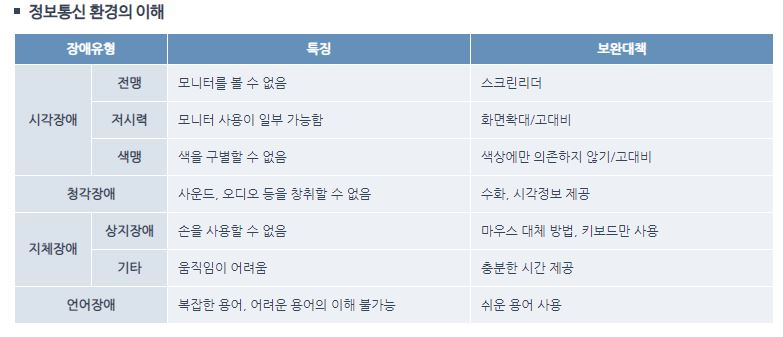

# Web Accessibility

### Web Accessibility란?

> 웹 접근성(Web Accessibility) 이란 **장애인, 고령자** 등이 웹 사이트에서 제공하는 정보에 **비장애인과 동등하게 접근하고 이해할 수 있도록 보장**하는 것입니다.

출처 : [Web Soul Lab](http://www.websoul.co.kr/accessibility/define.asp)