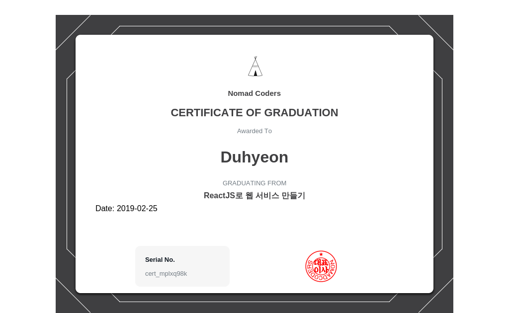

# React Basic

### [#1 시작하기](document/reactJsBasic01.md)

### [#2 컴포넌트 그리고 Props](document/reactJsBasic02.md)

### [#3 컴포넌트 Lifecycle](document/reactJsBasic03.md)

### [#4 State](document/reactJsBasic04.md)

### [#5 Stateless Functional Components](document/reactJsBasic05.md)

### [#6 AJAX](document/reactJsBasic06.md)

### #7 Finishing Up(document/reactJsBasic07.md)

### #8 Building for Production(document/reactJsBasic08.md)

## CERTIFICATE OF GRADUATION

## The history

- 19년 2월 19일 화요일 #1 완료

- 19년 2월 20일 수요일 #2 ~ 3 완료

- 19년 2월 21일 목요일 #4 ~ 5 완료

- 19년 2월 22일 금요일 #6 정리 중

- 19년 2월 25일 월요일 #7 완료