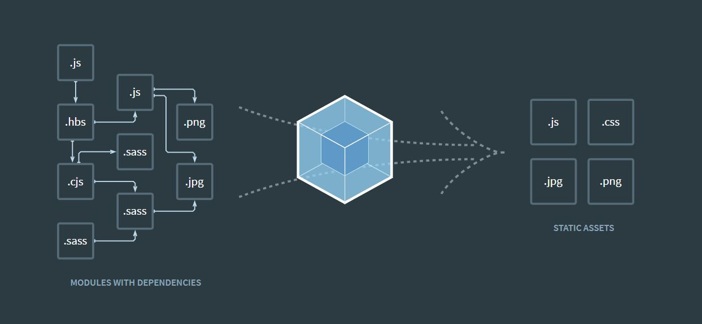

# React Basic #01

## #1 시작하기

### 설치하기

#### 1. window에서 Windows Subsystem for Linux를 사용하여 Ubuntu 설치(bash)

##### 1-1. 들어가서 설치

https://blogs.msdn.microsoft.com/eva/?p=7633


##### 1-2. 위에 주소로 설치가 안된다면 아래 주소

https://webnautes.tistory.com/1170

업데이트까지 완료하고 끝

#### 2. npm & Node.js & Yarn 설치

##### 2-1. [npm & Node.js](https://github.com/nodesource/distributions/blob/master/README.md#deb)

```
# Using Ubuntu
curl -sL https://deb.nodesource.com/setup_10.x | sudo -E bash -
sudo apt-get install -y nodejs
```

##### 2-2. [yarn](https://yarnpkg.com/en/docs/install#debian-stable)

```
curl -sS https://dl.yarnpkg.com/debian/pubkey.gpg | sudo apt-key add -
echo "deb https://dl.yarnpkg.com/debian/ stable main" | sudo tee /etc/apt/sources.list.d/yarn.list

sudo apt-get update && sudo apt-get install yarn
```

### React에 대해서

※ [TIL 정리 파일로 이동](/Learned/HandBook/03.LibraryEtc/learned_08_React.md)

### WebPack



> 각각의 환경이 다른 언어들을 사용자의 브라우저에서 호환을 시켜주는 프로그램

#### npm vs npx

##### 1. npm 문제점

1. create-react-app의 경우, npm으로 global하게 설치하게되면 자주 사용하지 않는 무거운 패키지가 로컬 스토리지에 남게 됨

2. 로컬 스토리지에 있는 패키지도 새로운 버전이 나왔을 시 이미 존재한 패키지를 제거하고 다시 설치해야 합니다.


##### 2. npx
> npx는 자바스크립트 패키지 관리 모듈인 npm(Node Package Module)의 npm@5.2.0 버전부터 새로 추가된 도구이다. 따라서 npm@5.2.0 이상 버전만 깔려 있다면 npx 커맨드를 사용 가능합니다.

1. **npm 실행스크립트 없이 로컬로 설치된 도구사용** : global로 설치되었던 mocha, grunt, gulp 및 bower와 같은 도구는 프로젝트별로 관리 할 수 ​​있습니다.

2. **일회성 명령실행** : 설치 패키지가 전역에 있지 않으므로 장기적으로 오염에 대해 걱정할 필요가 없습니다.

3. **다른 Node.js 버전으로 명령 실행** : 테스트 관리가 용의

    ex) mocha


출처 : [npx란 무엇인가?](https://geonlee.tistory.com/32)

#### Create React App

초보자를 위해 React에서 제공해주는 서비스

```
npx create-react-app 폴더명
cd 폴더명
npm start
```

출처 : [Create React App](https://github.com/facebook/create-react-app)